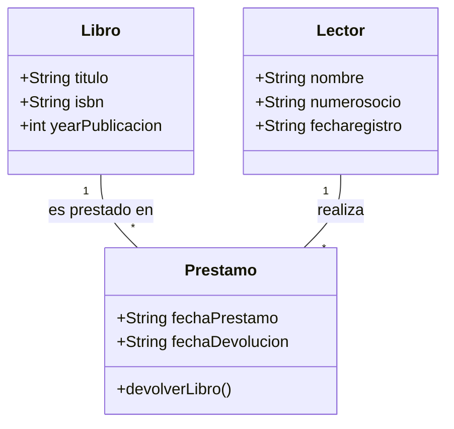

# 2.-Dise-o-Orientado-a-Objetos
Primer acercamiento y prácticas guiadas e individuales de POO
# Diagrama de Clases - Sistema de Biblioteca

# Relaciones y cardinalidad de los elementos
Libro-Préstamo

Un libro puede estar involucrado en varios préstamos en bastante tiempo.
Cada préstamo se asocia a un solo libro.
Cardinalidad: 1 a muchos (Un libro puede tener varios préstamos, pero cada préstamo pertenece a un solo libro).
Lector-Préstamo

Un lector puede realizar varios préstamos.
Cada préstamo está asociado a un solo lector.
Cardinalidad: 1 a muchos (Un lector puede hacer muchos préstamos, pero cada préstamo pertenece a un solo lector).
Préstamo-libro y lector

Cada préstamo vincula exactamente un libro y un lector en una fecha específica,lo que significa que sin un libro y un lector juntos no existe un prestamo.
Cardinalidad: muchos a 1 en ambas relaciones (muchos préstamos pueden referirse a un solo libro o a un solo lector)

